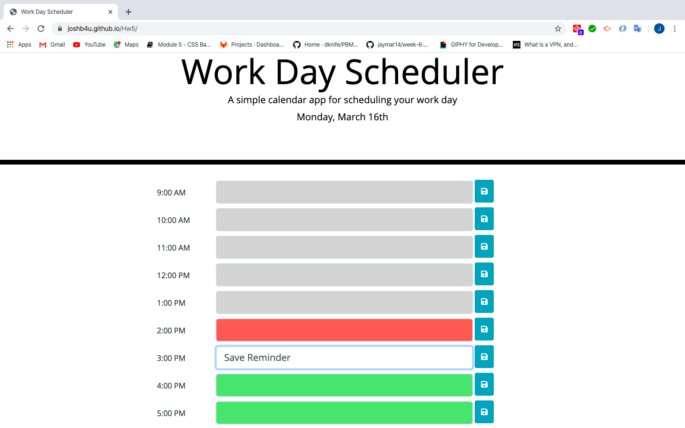
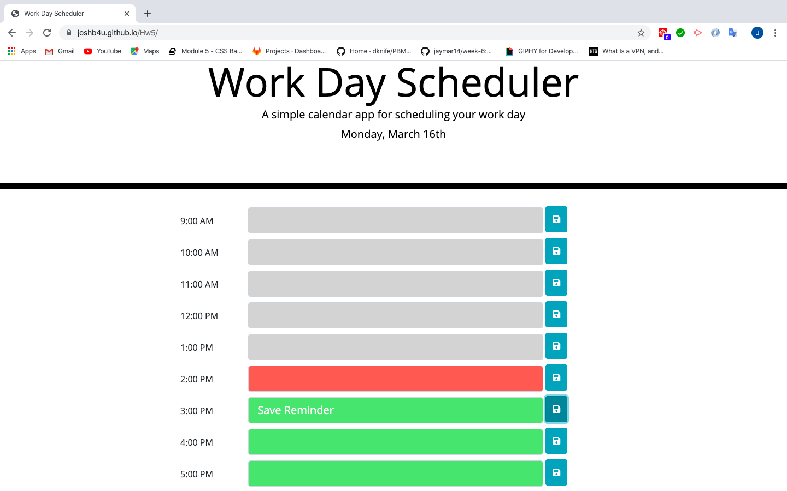

# Hw5

We have to create a simple daily planner for a single day from time 9am to 5pm, in such a way that the user can input reminders/things to do and should be saved and revealed even if the page is reloaded. Saving can be done by utilising local storage. For setting up time, moment.js can be used. The color codes should be such that red = current hour, green = upcoming hours, grey = lapsed hours.

#Pseudocode

1. Html to be created with respective classes that marks the header, date, hours, input boxes, and save buttons.
2. Moment.js to be used to set up the time.
3. If and else if conditions to be used in script.js that correspond sto the time and color code of the  current, upcoming, and lapsed hours.
4. Local storage to be used to save user inputs w.r.t save button.

#Screenshots

